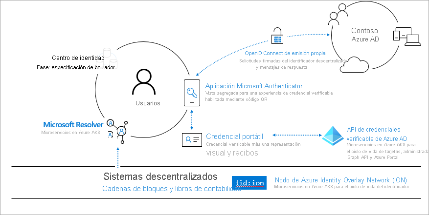
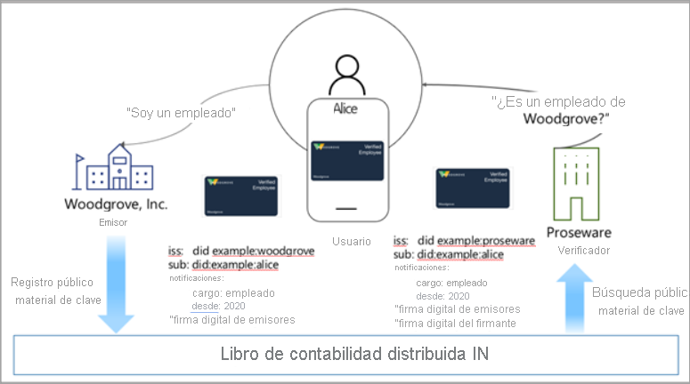

# <a name="introduction-to-azure-active-directory-verifiable-credentials-preview"></a>Introducción a Azure Active Directory Verifiable Credentials (versión preliminar)

> [!IMPORTANT]
> Azure Active Directory Verifiable Credentials se encuentra actualmente en versión preliminar pública.
> Esta versión preliminar se ofrece sin Acuerdo de Nivel de Servicio y no se recomienda para cargas de trabajo de producción. Es posible que algunas características no sean compatibles o que tengan sus funcionalidades limitadas. Para más información, consulte [Términos de uso complementarios de las Versiones Preliminares de Microsoft Azure](https://azure.microsoft.com/support/legal/preview-supplemental-terms/).

Tanto nuestra vida física como la digital cada vez están más vinculadas a las aplicaciones, los servicios y los dispositivos que usamos para acceder a un elevado número de experiencias. Esta transformación digital nos permite interactuar con cientos de empresas y miles de usuarios de maneras que antes eran inimaginables.

Sin embargo, los datos de identidad resultan expuestos con demasiada frecuencia en las vulneraciones de seguridad. Estas vulneraciones influyen considerablemente en las vidas sociales, profesionales y financieras de las personas. Microsoft considera que hay una manera mejor. Todas las personas tienen derecho a poseer y controlar una identidad que almacene de forma segura elementos de su identidad digital y que preserve la privacidad. En este manual se explica cómo aunamos esfuerzos con una variopinta comunidad para crear una solución de identidad descentralizada (DID) abierta, confiable, interoperable y basada en estándares apropiada tanto para personas como para organizaciones.

## <a name="why-we-need-decentralized-identity"></a>Motivos para usar una identidad descentralizada

Hoy en día utilizamos nuestra identidad digital en el trabajo, en casa y en todas las aplicaciones, servicios y dispositivos que usamos. Dicha identidad se compone de todo lo que decimos, hacemos y vivimos (comprar entradas para un evento, registrarnos en un hotel o incluso pedir comida a domicilio). En la actualidad, son otras partes las que poseen y controlan tanto nuestra identidad como todas nuestras interacciones digitales, y hay algunas de esas partes de las que ni siquiera somos conscientes.

Por lo general, los usuarios dan su consentimiento a varias aplicaciones y dispositivos. Este enfoque requiere un alto grado de vigilancia por parte del usuario para realizar un seguimiento de quién tiene acceso a la información. En lo que se refiere a la empresa, la colaboración con consumidores y asociados requiere una orquestación de alto nivel para intercambiar datos de forma segura de manera que se mantenga la privacidad y la seguridad de todos los implicados.

Creemos que un sistema de identidad descentralizada basado en estándares puede desbloquear un nuevo conjunto de experiencias que proporcionen a los usuarios y organizaciones un mayor control sobre sus datos (y ofrezcan un mayor grado de confianza y seguridad tanto a las aplicaciones, como a los dispositivos y proveedores de servicios)

## <a name="lead-with-open-standards"></a>Uso fructífero de estándares abiertos

Estamos decididos a trabajar codo con codo no solo con nuestros clientes y asociados, sino también con la comunidad para desbloquear las nuevas experiencias basadas en identidad descentralizada y nos resulta muy atractivo asociarnos con todas aquellas personas y organizaciones que estén realizando increíbles contribuciones en este ámbito. Si el ecosistema de la identidad descentralizada está destinado a crecer, tanto los estándares como los componentes técnicos y el código resultante deben ser de código abierto y todo el mundo debe poder acceder a ellos.

Microsoft ha establecido una colaboración activa con miembros de Decentralized Identity Foundation (DIF), el grupo W3C Credentials Community Group y la amplia comunidad de identidades. Hemos trabajado junto con estos grupos para identificar y desarrollar estándares críticos, y los siguientes estándares se han implementado en nuestros servicios.

* [W3C Decentralized Identifiers](https://www.w3.org/TR/did-core/)
* [W3C Verifiable Credentials](https://www.w3.org/TR/vc-data-model/)
* [DIF Sidetree](https://identity.foundation/sidetree/spec/)
* [DIF Well Known DID Configuration](https://identity.foundation/specs/did-configuration/)
* [DIF DID-SIOP](https://identity.foundation/did-siop/)
* [DIF Presentation Exchange](https://identity.foundation/presentation-exchange/)


## <a name="what-are-dids"></a>¿Qué son los identificadores descentralizados?

Para llegar a comprender lo que son los identificadores descentralizados, resulta de gran ayuda establecer una comparación con los sistemas de identidad actuales. Tanto las direcciones de correo electrónico como los identificadores de las redes sociales son alias descriptivos para la colaboración, pero ahora están sobrecargados, porque sirven como puntos de control para el acceso a datos en muchos escenarios que van más allá de la colaboración, lo que crea un posible problema, ya que las entidades externas pueden revocar en cualquier momento el acceso a estos identificadores.

Los identificadores descentralizados (DID) son diferentes, son identificadores globalmente únicos, privados y generados por el usuario cuya raíz se encuentra en sistemas descentralizados como ION. Poseen características únicas, como una mayor garantía de inmutabilidad, resistencia a la censura y evasión de la alteración. Estos atributos son fundamentales para cualquier sistema de identificadores que esté destinado a proporcionar control de usuario y autopropiedad. 

La solución de credenciales verificables de Microsoft usa credenciales descentralizadas (DID) para firmar de forma criptográfica como prueba de que un usuario de confianza (verificador) está atestiguando la información que demuestra que son los propietarios de una credencial verificable. Por lo tanto, se recomienda que todos aquellos que deseen crear una solución de credenciales verificables mediante la oferta de Microsoft tengan un conocimiento básico de los identificadores descentralizados.
## <a name="what-are-verifiable-credentials"></a>¿Qué son las credenciales verificables?

 A diario usamos distintas formas de identificarnos. Tenemos carnet de conducir, que usamos como evidencia de somos capaces de manejar un automóvil. Las universidades expiden diplomas que demuestran que hemos logrado cierto nivel de educación. Usamos pasaportes para demostrar a las autoridades quiénes somos cuando viajamos a otros países. El modelo de datos describe cómo podemos controlar estos tipos de escenarios cuando se trabaja en Internet, pero de una forma segura que respete la privacidad del usuario. Para obtener información adicional, consulte el estándar [Verifiable Credentials Data Model 1.0](https://www.w3.org/TR/vc-data-model/)

En resumen, las credenciales verificables son objetos de datos que se componen de las notificaciones realizadas por el emisor que da fe de la información sobre un sujeto. Estas notificaciones las identifica un esquema e incluyen la identidad descentralizada del emisor y el asunto. La identidad descentralizada del emisor crea una firma digital como prueba de que da fe de esta información.


## <a name="how-does-decentralized-identity-work"></a>¿Cómo funciona la identidad descentralizada?

Necesitamos una nueva forma de identidad. Necesitamos una identidad que reúna las tecnologías y los estándares, con el fin de proporcionar atributos de identidad clave, como la autopropiedad, y la resistencia a la censura. Estas funcionalidades son difíciles de lograr con los sistemas existentes.

Para cumplir estas promesas, necesitamos una base técnica compuesta de siete innovaciones clave. Una de estas innovaciones son los identificadores que son propiedad del usuario, un agente de usuario para administrar las claves asociadas a tales identificadores y unos almacenes de almacenamiento cifrados controlados por el usuario.



**1. W3C Decentralized Identifiers (DID)** . Identificadores que los usuarios crean, poseen y controlan independientemente de cualquier organización o gobierno. Los DID son identificadores únicos globales que están vinculados a metadatos de una infraestructura de clave pública (DPKI) descentralizada que se componen de documentos JSON que contienen material de clave pública, descriptores de autenticación y puntos de conexión de servicio.

**2. Sistema descentralizado: ION (Identity Overlay Network)** . ION es una red de nivel 2 abierta y sin permisos que se basa el protocolo Sidetree, que es puramente determinista y no requiere tokens especial, validadores de confianza u otros mecanismos de consenso; lo único que se necesita para que funcione es la progresión lineal de la cadena de tiempo de Bitcoin. Hemos [creado un paquete npm de código abierto](https://www.npmjs.com/package/@decentralized-identity/ion-tools) para facilitar la integración de la red de ION en sus aplicaciones y servicios. Las bibliotecas incluyen la creación de una DID, la generación de claves y el anclaje de la DID a la cadena de bloques de Bitcoin. 

**3. DID User Agent/Wallet: la aplicación Microsoft Authenticator**. Permite que gente real use identidades descentralizadas y credenciales verificables. Microsoft Authenticator crea identidades descentralizadas, facilita las solicitudes de emisión y presentación de credenciales verificables y administra la copia de seguridad de la inicialización de la identidad descentralizada realizada a través de un archivo .wallet cifrado.

**4. Microsoft Resolver**. Una API que se conecta a nuestro nodo de ION para buscar y resolver identidades descentralizadas mediante el método ```did:ion``` y devolver el objeto de documento DID (DDO). El DDO incluye metadatos de DPKI asociados a la identidad descentralizada, como las claves públicas y los puntos de conexión de servicio. 

**5. Servicio Azure Active Directory Verified Credentials**. Una API de emisión y comprobación y un SDK de código abierto para las credenciales [W3C Verifiable Credentials](https://www.w3.org/TR/vc-data-model/) firmadas con el método ```did:ion```. Permiten a los propietarios de identidad generar, presentar y comprobar las notificaciones. Esto constituye la base de la confianza entre los usuarios de los sistemas.

## <a name="a-sample-scenario"></a>Un escenario de ejemplo

El escenario que usamos para explicar el funcionamiento de las credenciales verificables incluye:

- Woodgrove Inc., una empresa.
- Proseware, una compañía que ofrece descuentos a los empleados de Woodgrove.
- Alice, una empleada de Woodgrove, Inc. que quiere obtener un descuento en Proseware


En la actualidad, Alice utiliza un nombre de usuario y una contraseña para iniciar sesión en el entorno de la red de Woodgrove. Woodgrove está implementando una solución de credenciales verificables que permita a Alice demostrar más fácilmente que es empleada de Woodgrove. Proseware usa una solución de credenciales verificables compatible con la solución de Woodgrove y acepta las credenciales emitidas por Woodgrove como prueba de empleo.

El emisor de la credencial, Woodgrove Inc., crea una clave pública y una clave privada. La primera se almacena en ION. Cuando la clave se agrega a la infraestructura, la entrada se registra en un libro de contabilidad descentralizado basado en cadena de bloques. El emisor proporciona a Alice la clave privada que se almacena en una aplicación de cartera. Cada vez que Alice usa correctamente la clave privada, la transacción se registra en la aplicación de cartera.



## <a name="roles-in-a-verifiable-credential-solution"></a>Roles en una solución de credenciales verificables 

En cualquier solución de credenciales verificables hay tres actores principales. En el diagrama siguiente:

- **Paso 1**: el **usuario** solicita una credencial verificable a un emisor.
- **Paso 2**: el **emisor** de la credencial da fe de que la prueba que ha aportado el usuario es precisa y crea una credencial verificable firmada con su DID y el DID del usuario es el asunto.
- **Paso 3**: el usuario firma una presentación verificable (VP) con su DID y se la envía al **comprobador.** A continuación, este valida la credencial coincidentes con la clave pública colocada en el DPKI.

Los roles de este escenario son:


**emisor**: el emisor es una organización que crea una solución de emisión que solicita información a un usuario. Esta información se usa para comprobar la identidad del usuario. Por ejemplo, Woodgrove, Inc. tiene una solución de emisión que les permite crear y distribuir credenciales verificables (VC) a todos sus empleados. El empleado usa la aplicación Authenticator para iniciar sesión con su nombre de usuario y contraseña, que pasa un token de identificador al servicio emisor. Una vez que Woodgrove, Inc. valida este token, la solución de emisión crea una credencial verificable que incluye notificaciones sobre el empleado y que está firmada con la DID de Woodgrove, Inc. El empleado ahora tiene una credencial verificable firmada por su empleador, que incluye la DID de los empleados como DID del asunto.  

**usuario**: el usuario es la persona o entidad que solicita una credencial verificable. Por ejemplo, Alice es una nueva empleada de Woodgrove, Inc. que previamente ha emitido una credencial verificable que demuestra que trabaja en esa empresa. Cuando Alice tiene que proporcionar una prueba de empleo para obtener un descuento en Proseware, puede conceder acceso a la credencial en su aplicación Authenticator mediante la firma de una presentación verificable que demuestre que Alice es la propietaria de la DID. Proseware puede validar que Woodgrove, Inc. ha emitido la credencial y que Alice es la propietaria de la credencial. 

**comprobador**: el comprobador es una empresa o entidad que necesita comprobar las notificaciones de uno o varios emisores en los que confían. Por ejemplo, Proseware confía en que Woodgrove, Inc. realiza un trabajo adecuado de comprobación de la identidad de sus empleados y emisión un credenciales verificables auténticas y válidas. Cuando Alice intente solicitar el equipo que necesita para su trabajo, Proseware usará estándares abiertos como SIOP y Presentation Exchange para solicitar al usuario credenciales que demuestren que es empleado de Woodgrove, Inc. Por ejemplo, Proseware podría proporcionar a Alice un vínculo a un sitio web con un código QR que pueda leer con la cámara de su teléfono. De esta forma se inicia la solicitud de una credencial verificable concreta, que la aplicación Authenticator analizará y dará a Alice la capacidad de aprobar la solicitud para demostrar a Proseware que trabaja en Woodgrove, Inc. Proseware puede usar la API o el SDK del servicio de credenciales verificables para comprobar la autenticidad de la presentación verificable. Y, en función de la información que proporcione Alice, esta podrá disfrutar del descuento. Si otras compañías y organizaciones saben que Woodgrove, Inc. genera credenciales verificables para sus empleados, también pueden crear una solución de comprobación y usar la credencial verificable de Woodgrove, Inc. para proporcionar ofertas especiales reservadas a los empleados de Woodgrove, Inc.

## <a name="next-steps"></a>Pasos siguientes

Ahora que sabe lo que son las identidades descentralizadas y las credenciales verificables, pruébelas siguiendo nuestro artículo de introducción o cualquier otro de nuestros artículos en los que se proporcionen más detalles sobre los conceptos de credenciales verificables.

- [Introducción a las credenciales verificables](get-started-verifiable-credentials.md)
- [Personalización de credenciales](credential-design.md)
- [Preguntas frecuentes sobre las credenciales verificables](verifiable-credentials-faq.md)